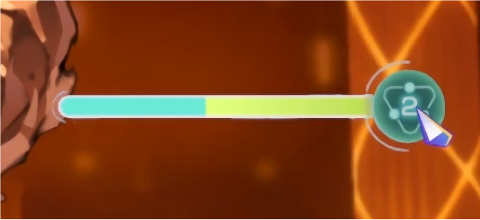

# Guide to Creating MODs Related to the `OD System`

## Introduction

The `OD System` (OverDrive System) comes from the mobile game [Heaven Burns Red](https://heaven-burns-red.com/). In this mod, I’ve tried my best to replicate the original system, with the intention of adding some new gameplay and enjoyment to the game. Additionally, I’ve created some interfaces to facilitate character development. If you want to try creating a character related to the `OD System`, this guide will provide you with ample help.

Before development, please copy all the files from the `ODBarSystem\Assemblies` directory into your project folder and reference them. Common functions are annotated with XML comments, which you can refer to during development.

---

[TOC]

## Basic Explanation of the OD System

This section introduces the basics of the OD system, which is displayed like this photo:

<center>

</center>

---

### 1. Activation Effects

When the energy bar accumulates at least one bar (maximum accumulation is three bars), you can click the button to activate OD, consuming all current energy and obtaining the following effects:

* During the activation of OD, all enemies will be unable to act (except for individual skills that set the countdown directly to 0); the countdown for the enemies' actions will not decrease.
* Gain combat benefits based on the energy consumed when activating OD:
  
  `Consume 100 points (one bar)`: All cards in hand cost reduced by  **1** ; OD status is released after playing **2** cards.
  
  `Consume 200 points (two bars)`: All cards in hand cost reduced by  **2** ; OD status is released after playing **3** cards.
  
  `Consume 300 points (three bars)`: All cards in hand cost reduced by  **3** ; OD status is released after playing **3** cards.
* Final damage increased by **10%** (using the same damage timing as with pipes).

*Additionally, pressing the end turn button will directly release the OD status.*

---

### 2. Methods to Accumulate OD Energy

OD energy can be obtained primarily through three methods:

1. Gaining energy after skill hits.
2. Gaining energy when Dot-type damage is calculated.
3. Directly acquiring energy through a function.
   **Note: In the current version, the first two methods can only gain energy if the target is an enemy.**

#### 2.1 Gaining Energy After Hitting an Enemy with Skills

In this MOD, I introduced three new basic attributes for OD calculations, including:

`Combo Energy (PlusOdEnergy)` (each point of combo energy provides 2.5 points of OD), `OD Gain Amount (PlusPerOd)` (provides a percentage-based bonus), and `Directly Gain OD Value (plusOd)` (OD Gain  directly without calculation).

When a skill hits an opponent, the calculation of OD energy will occur, with the specific calculation process detailed below. The timing for this will be explained in the timing summary.

---

##### Simplified Calculation Process

When a skill that hits an enemy is an additional attack, skip all calculation processes and default to providing 2.5 points of OD energy. Other situations follow the calculation process below:

1. **IP_ChangeApBeforeOd** : Set the AP consumption amount for the skill hitting the enemy to be used in the OD calculation, `NewApForOD` (only effective for OD acquisition calculation, does not actually change AP consumption, defaults to the skill's AP before OD activation).
2. **Initialize OD Related Variables** : Initialize `plusPerOd`, `plusOd`, and `PlusOdEnergy`, defaulting to no modification.
3. **IP_ChangeOdEnergy** : Modify the additional combo energy for the skill hitting the enemy, `exOdEnergy`.
4. **ODbase Calculation** : Calculate the OD value based on the above values.
5. **IP_OdChangeAfterBuff** : Change the OD value obtained from the ODbase calculation: `extraod`.
6. **Modify ODbase** : Process the modifications to OD values using `plusPerOd` and `plusOd`.
7. **IP_OdCacuEnd** : Complete the OD calculation for the skill that hits the enemy, filling the OD energy into the OD slot.

$$
ODEnergy = （5+ NewApForOD +(PlusOdEnergy+exOdEnergy)*2.5+extraod）*plusPerOd+plusOd
$$

计算流程大概可以如下表示：


#### 2.2 Gaining Through Dot Damage

1. Before each enemy action, if a `Dot-type Debuff` is applied to the enemy, each type of Debuff gains 2.5 points of OD energy;

```csharp
IP_ChangeApBeforeOd //effect before each type of Debuff damage calculation, can modify `ExtraOD` to change the OD energy gained by this DOT
```

2. For triggered Dot damage types such as Solar Flame or snow blade, gain 2 points of OD energy each time triggered.

#### 2.3 Directly Obtaining Through Functions

Only Use this method to change OD:

```csharp
StatementManger.ChangeOdCount(ODbase);
//ODbase accepts a floating type, ranging between [-300-300].
```

---

## Interface

This section provides a detailed explanation of the MOD's interface for easy reference during MOD creation.

#### 3.1 OnePassive

In the game of "Chrono Ark," using interfaces inevitably involves:

```csharp
OnePassive =true // OR False?
```

In this Mod, I designed several user-friendly interfaces based on the original logic. To properly use these interfaces, I will explain the timing related to OnePassive (the explanation also applies to similar original interfaces) in the simplest way to reduce confusion during MOD creation.

Firstly, we need to define two terms; all descriptions in this chapter will be based on these.

* **Active Trigger** : Effects that are actively triggered by player actions (including effects triggered when using skills, clicking buttons, etc.)
* **Triggered** : Effects that are activated without player intervention, simply by meeting certain conditions (including all BUFFs, skill effects that automatically trigger under certain conditions in hand, etc.)

Based on this, I’ve summarized the use of OnePassive for all timings in this article in the following table for your reference.

<center>

.png)</center>

</center>

#### 3.2 Timing Usage Explanation

**Note: The section on the OnePassive settings below has been completed in the base class, so some parts are not marked again. Please strictly follow the above for using the OnePassive interface.**

##### IP_ChangeApBeforeOd

```csharp
publicinterfaceIP_ChangeApBeforeOd
{
///<summary>
/// Set the AP consumption amount for the skill hitting the enemy, used for calculating OD (only effective for OD acquisition calculation, does not actually change AP consumption).
/// 【BattleChar's IReturn, supports returning the skill used】
///</summary>
///<param name="SkillD">The skill hitting the enemy</param>
///<param name="Target">The information of the hit enemy</param>
///<param name="NewApForOD">The AP consumption amount for calculating OD, set to -1 to calculate based on the skill's original AP</param>
///<returns>Used for enemy settings, refer to B_MonsterBuff_S1_ArmorBoss to ensure the priority of monster buff settings is the highest</returns>
boolSkillChangeApBeforeOd(Skill SkillD, BattleChar Target, refint NewApForOD);
}
```

Usage Example: B_MonsterBuff_S1_ArmorBoss

```csharp
///<summary>
/// Armor Protection
/// When the breathing armor has a shield that can "block one attack," all attacks will be treated as 1AP for calculating OD acquisition, and the combo energy of the skill will decrease by 2 points.
///</summary>
publicclassB_MonsterBuff_S1_ArmorBoss : MonsterBuffBase, IP_ChangeApBeforeOd, IP_ChangeOdEnergy, IP_PlayerTurn_1
{
bool IP_ChangeApBeforeOd.SkillChangeApBeforeOd(Skill SkillD, BattleChar Target, refint NewApForOD)
    {
if (PerfectShieldmark)
        {
            NewApForOD = 1;
returntrue;
        }
returnfalse;
    }

void IP_ChangeOdEnergy.ChangeOdEnergy(Skill SkillD, BattleChar Target, refint exOdEnergy)
    {
if (PerfectShieldmark)
        {
            exOdEnergy = -2;
            PerfectShieldmark = false;
        }
    }
publicvoidTurn1()
    {
        PerfectShieldmark = true;
    }
privatebool PerfectShieldmark = false;
}
```

---

##### IP_ChangeOdEnergy

```csharp
publicinterfaceIP_ChangeOdEnergy
{
///<summary>
/// Modify the additional combo energy for the skill hitting the enemy, later than IP_AllChangeApHitsBeforeOd.
/// 【BattleChar's IReturn, supports returning the skill used】
///</summary>
///<param name="SkillD">The skill hitting the enemy</param>
///<param name="Target">The skill target (BattleEnemy)</param>
///<param name="exOdEnergy">Additional combo energy</param>
voidChangeOdEnergy(Skill SkillD, BattleChar Target, refint exOdEnergy);
}
```

Usage Example: B_MonsterBuff_S1_ArmorBoss (see above)

---

##### IP_DotOdBefore

```csharp
publicinterfaceIP_DotOdBefore
{
///<summary>
/// The timing before the settlement of the current dot-type BUFF each round. Use ExtraOD to adjust the additional OD gained or reduced by this Dot.
///</summary>
///<param name="Hit">The dot object's BattleEnemy</param>
///<param name="ExtraOD">Return value: The additional gain or reduction of OD from the Dot</param>
voidExtraOdByDotBuff(BattleChar Hit, reffloat ExtraOD);
}
```

Usage Example: B_MizuharaAina_DR1

```csharp
namespaceMizuharaAina
{
///<summary>
/// Protein Decomposition Toxin
/// Defense permanently decreases; during actions, deals Dot damage equal to 7% of current HP; decomposed proteins will convert into OD energy, and the damage from this BUFF will proportionally increase the OD gain from this Dot.
///</summary>
publicclassB_MizuharaAina_DR1 : BuffOD, IP_TurnEnd
    {
publicoverridevoidInit()
        {
            PlusStat.def = -10;
base.Init();
        }
publicvoidTurnEnd()
        {
            dmg = AinaDataBase.CantDebuffEnemy.Contains(BChar.Info.KeyData)
                ? 10
                : Math.Max(1, BChar.HP * 7 / 100);

            PlusDamageTick = dmg;
        }

publicoverridevoidExtraOdByDotBuff(BattleChar Hit, reffloat ExtraOD) => ExtraOD = Math.Min(10, dmg / 10);

privateint dmg = 0;
    }
}
```

---

##### IP_ExceptDeckReturnHand（must use function BV_ExceptDLC.GetSkillBackFromBV_ExceptDeck() to trigger）

```csharp
publicinterfaceIP_ExceptDeckReturnHand
{
///<summary>
/// Timing when a skill returns from the exile deck to the hand (only the target skill itself is effective).
///</summary>
voidAt_ExceptDeckReturnHand();
}
```

Usage Example: S_MizuharaAina_7

```csharp
///<summary>
/// Ambush Fishing
/// Enters <color=#17FF00>Net Fishing</color> state. When attacked, restores max health and increases OD received from damage.
/// This card returns from the exile deck to the hand, healing all members &heal (60% of healing power) and entering <color=#17FF00>Net Fishing</color> state.
///</summary>
publicclassS_MizuharaAina_7 : Skill_Extended, IP_ExceptDeckReturnHand
{
publicoverridestringDescExtended(string desc) => base.DescExtended(desc).Replace("&heal", $"{Mathf.Round(BChar.GetStat.reg)}");

publicvoidAt_ExceptDeckReturnHand()
    {
        BattleSystem.instance.AllyTeam.AliveChars.ForEach(bc => bc.Heal(BChar, BChar.GetStat.reg, 60, 0, 0));
        BChar.BuffAdd("B_MizuharaAina_7", BChar);
    }
}
```

---

##### IP_OdBase

```csharp
///<summary>
/// Basic properties of the Od system, suitable for skills, character passives, buffs, equipment, relics, etc. (detailed triggering content below, later than all points that change AP and combo energy, earlier than points that modify additional Od, refer to flowchart).
/// Passive triggers for the caster, passive triggers for the target, active use of skills that trigger, fixed skill active use triggers, buff triggers (both sides), relic triggers, equipment triggers.
///</summary>
publicinterfaceIP_OdBase
{
///<summary>
/// OD percentage bonus, multiplied by the base OD of the skill.
///</summary>
    [Description("OD percentage bonus, multiplied by the base OD of the skill.")]
float PlusPerOd { get; set; }

///<summary>
/// Directly adds the value to the OD slot, range: (-300~300), not affected by any bonuses.
///</summary>
    [Description("Directly increases the value in the OD slot, range: (-300~300), not affected by any bonuses.")]
float PlusOd { get; set; }

///<summary>
/// Combo energy, each point of energy provides 2.5 points of OD.
///</summary>
    [Description("Combo energy, each point of energy provides 2.5 points of OD.")]
int PlusOdEnergy { get; set; }
}
```

使用示例：BuffOD baseclass

```csharp
publicclassBuffOD : Buff, IP_DotOdBefore, IP_OdBase
{
// OD-related buffs can inherit from this class to directly use the functionalities of IP_DotOdBefore and IP_OdBase.
publicvirtualvoidExtraOdByDotBuff(BattleChar Hit, reffloat ExtraOD)
    { }

publicvirtualfloat PlusPerOd { get; set; }
publicvirtualfloat PlusOd { get; set; }
publicvirtualint PlusOdEnergy { get; set; }
}
```

---

##### IP_OdCacuEnd

```csharp
publicinterfaceIP_OdCacuEnd
{
///<summary>
/// The OD calculation for the skill hit is complete, and the value is filled into the OD slot.
/// BattleSystem's IReturn.
///</summary>
///<param name="SP">The skill hitting the enemy</param>
///<param name="Tar">The target: only enemies</param>
///<param name="Od">The OD value filled after the skill calculation</param>
voidOdCacuEnd(SkillParticle SP, BattleChar Tar, float Od);
}
```

使用示例：B_MizuharaAina_1

```csharp
///<summary>
/// Pirate Combo
/// The next skill hitting the enemy increases combo energy by &a points and removes this benefit from all allies after it takes effect.
///</summary>
publicclassB_MizuharaAina_1 : BuffOD, IP_OdCacuEnd
{
publicoverridestringDescExtended()
    {
if (BattleSystem.instance != null)
returnbase.DescExtended().Replace("&a", $"{PlusOdEnergy}");
returnbase.DescExtended().Replace("&a", "0");
    }

public IEnumerator RemoveAction()
    {
foreach (var Bchar in BattleSystem.instance.AllyTeam.AliveChars)
        {
            Bchar.BuffRemove("B_MizuharaAina_1", ForceRemove: true);
        }
yieldbreak;
    }

publicvoidOdCacuEnd(SkillParticle SP, BattleChar Tar, float Od) => BattleSystem.DelayInput(RemoveAction());

publicoverrideint PlusOdEnergy { get; set; }
}
```

---

##### IP_OdChangeAfterBuff

```csharp
[Description("After the skill OD calculation, can modify ExtraOD to control the increase or decrease of od.")]
publicinterfaceIP_OdChangeAfterBuff
{
///<summary>
/// After skill OD calculation, can modify ExtraOD to control the increase or decrease of od.
/// 【Only effective for skill_extended.】
///</summary>
///<param name="SkillD">The skill hitting the enemy</param>
///<param name="User">The user</param>
///<param name="Target">The hit enemy</param>
///<param name="ExtraOD">Additional increase or decrease of OD</param>
voidOdSkillChangeBeforeFinal(Skill SkillD, BattleChar User, BattleChar Target, reffloat ExtraOD);
}
```

Usage Example: S_MizuharaAina_R2

```csharp
///<summary>
/// PlusOdEnergy = 2;
/// When the battle starts and あいな is on the field, gain <color=#35F9FF>Ocean Heart</color> based on the number of enemies.
/// After hitting the enemy with the skill, gain an additional 50 points of OD and deal pain damage equal to 10% of max HP; then prioritize drawing one of your skills; when returning from the exile deck to the hand, restore 1 AP to allies; this card's cost will increase by 3 for the rest of this battle.
///</summary>
public class S_MizuharaAina_R2:S_MizuharaAina_Base,IP_ExceptDeckReturnHand,IP_BattleStart_Ones
{
    public override void Init()
    {
        
        PlusOdEnergy = 2;
        base.Init();

    }

    public void BattleStart(BattleSystem Ins)
    {
        if (Ins != null && Ins.AllyTeam.AliveChars.FirstOrDefault(bc => bc.Info.KeyData == "MizuharaAina") != null)
            BattleSystem.instance.StartCoroutine(Delay());
    }

    public override void OdSkillChangeBeforeFinal(Skill SkillD, BattleChar User, BattleChar Target, ref float ExtraOD)
    {
        ExtraOD = 50;
        Target.Damage(BChar, Target.GetStat.maxhp / 10, false, true);
        BattleSystem.instance.AllyTeam.CharacterDraw(BChar);

    }
}
```

---

##### IP_OdDown

```csharp
[Description("When OD decreases (activating OD will not trigger this point)")]
public interface IP_OdDown
{
/// <summary>
/// When OD decreases (activating OD will not trigger this point)
/// 【Triggered by IReturn in BattleSystem】
/// </summary>
/// <param name="dltOd">Amount of OD decreased (positive number)</param>
void AtOdDown(float dltOd);
}
```

---

##### IP_OdEnd

```csharp
public interface IP_OdEnd
{
/// <summary>
/// When OD ends
/// 【This can be triggered in two situations: when the turn end button is pressed or when the OD effect count is exhausted】【Triggered by IReturn in BattleSystem】
/// </summary>
/// <param name="odLevel">The level of the OD activated this time</param>
/// <param name="odCountDuringOd">The total OD energy gained during this activation</param>
void AtOdEnd(int odLevel, float odCountDuringOd);
}
```

exp：S_MizuharaAina_2

```csharp
/// <summary>
/// FRILLED SHARK BLADE
/// Applies <color=#E560FF>Od Fragile</color> to the enemy for 3 turns; during OD, the cost of this skill becomes 0 and is used quickly.
/// <color=#35F9FF>Heart of the Ocean</color>: 2
/// Applies <color=#17FF00>【Let's Be Good Friends with Aina】</color> for one turn.
/// <color=#35F9FF>Heart of the Ocean</color>: 4
/// After applying, if there is <color=#EDFAEC>【Savor the Profound Flavor】</color> in the deck, add one card from it to your hand, reduce its cost to 0, and shuffle the deck.
/// </summary>

public class S_MizuharaAina_2:S_MizuharaAina_Base
{
    public override void Init()
    {
        oceanHeartCost1 = 2;
        oceanHeartCost2 = 4;
        base.Init();
    }

    public override IEnumerator DrawAction()
    {
        if (StatementManger.OdSystemOn())
        {
            APChange = -MySkill.AP;
            MySkill.NotCount = true;
        }
        yield break;
    }

    public override void AtOdStart(int OdLevel)
    {
        base.AtOdStart(OdLevel);
        APChange = -MySkill.AP;
        MySkill.NotCount = true;
    }

    public override void AtOdEnd(int odLevel, float odCountDuringOd)
    {
        base.AtOdEnd(odLevel, odCountDuringOd);
        APChange = 0;
        MySkill.NotCount = false;
    }
```

---

##### IP_OdTrigerOn

```csharp
public interface IP_OdTrigerOn
 {
/// <summary>
/// When OD is activated, the IReturn scope of the BattleSystem can be used.
/// </summary>
/// <param name="OdLevel">Current OD level</param>
/// The effect of reducing costs during OD occurs before AtOdStart, so even if the skill cost is reduced again at that point, it will correctly return to the original cost after it ends.
/// void AtOdStart(int OdLevel);
 }
```

exp：S_MizuharaAina_2 （see above）

---

##### IP_OdIncrease

```csharp
public interface IP_OdIncrease
 {
     /// <summary>
     ///At OD energy increase【BattleSystem's IReturn】
     /// </summary>
     /// <param name="dlt"></param>
     void OdIncrease(float dlt);
 }
```

exp：B_MizuharaAina_P

```csharp
/// <summary>
/// Points remaining to obtain the Heart of the Ocean next time: &a points of OD
/// Other OD gain bonuses: &c%
/// </summary>
public class B_MizuharaAina_P : B_MizuharaAina_Base, IP_TurnEnd, IP_OdIncrease
{
/// <summary>
/// Triggered, OD increases, attempt to update the Heart of the Ocean
/// </summary>
/// <param name="dlt"></param>
void IP_OdIncrease.OdIncrease(float dlt) => PassiveControler.Instance.Odfilter += dlt;
```

---

#### 3.3 OD-Related Functional Functions

This section contains functional functions related to controlling OD that you may use. All OD-related functions are in the static class StatementManager, and you can access them by using StatementManager.functionName directly.

| Function Name                                           | Functionality                                                                                  |
| --------------------------------------------------------- | ------------------------------------------------------------------------------------------------ |
| public static bool OdSystemOn()                         | Determines if OD is currently activated                                                        |
| public static IEnumerator OdForceOn(int odLevel)        | (Coroutine) Forces OD activation when OD energy exceeds 100                                    |
| public static int GetOdLevel()                          | Returns the current activated OD level                                                         |
| **public static void ChangeOdCount(float value)** | The only method to fill or reduce OD energy                                                    |
| public static float GetOdCount()                        | Gets the current OD value                                                                      |
| public static float GetOdCountDuringOD()                | Used only during OD activation, retrieves the current accumulated OD value after OD activation |

---

#### 3.4 Exiled Deck DLC

Based on [贰玖君](https://steamcommunity.com/profiles/76561198339815561/myworkshopfiles/)'s BasicMethod in the Workshop, I have extended the functionality of the Exiled Deck. The extended functionality is implemented under the `BV_ExceptDLC` class.

| Function Name                                                                           | Functionality                          |
| ----------------------------------------------------------------------------------------- | ---------------------------------------- |
| public static IEnumerator GetSkillBackFromBV_ExceptDeck (parameter description follows) | Batch draw skills from the Exiled Deck |

When used in conjunction with the interface `IP_ExceptDeckReturnHand`, it can trigger specially crafted skill effect animations. The specific parameter descriptions are as follows:

```csharp
///<summary>
///<param name="num">Number of skills to draw</param>
///<param name="onlyDrawMasterID">Only draw skills from this character ID (skill.Master.Info.KeyData == onlyDrawMasterID)</param>
///<param name="exceptSkillHashSet">HashSet of skills to exclude, pass in MySkill.KeyID</param>
///<param name="drawWithBattleExtended">Optional Battle_extended to attach to the drawn skills</param>
///<returns></returns>
publicstatic IEnumerator GetSkillBackFromBV_ExceptDeck(int num, string onlyDrawMasterID = "", HashSet<string> exceptSkillHashSet = null, Skill_Extended drawWithBattleExtended = null)
```

It's important to note that the parameter `exceptSkillHashSet` is necessary because returning cards from the Exiled Deck is not an operation present in the original game. Therefore, you need to filter out skills that should not be returned to the hand. You should pass in a `HashSet<string>` containing `MySkill.KeyID` to filter the Exiled Deck and avoid returning unexpected skills.

I have already included a basic collection that excludes skills related to game mechanics and those that generate skills in bulk (such as Phantom Sword). You can simply pass `DevDatabase.cantBeGetBackExcepted` as a parameter to achieve filtering.

Additionally, `drawWithBattleExtended` is a convenient parameter; you just need to create a temporary `Skill_Extended` and pass it in to add desired extensions to the drawn skills. You can refer to methods like S_MizuharaAina_3, S_MizuharaAina_8 for usage examples, and a simplified code demonstration is as follows:

```csharp
//without json 
public class Ext_Aina_8:Skill_Extended
{
    public override void Init()
    {
        MySkill.AP = 1;
        base.Init();
    }

    public override void SkillUseSingle(Skill SkillD, List<BattleChar> Targets)
    {
        BattleExtended = false;
        SelfDestroy();
    }
}
// Other code
Ext_Aina_8 ext = new Ext_Aina_8(); // Create a temporary extension, no need for JSON
yieldreturn BV_ExceptDLC.GetSkillBackFromBV_ExceptDeck(num: 1,
    exceptSkillHashSet: AinaDataBase.cantBeGetBackExcepted, drawWithBattleExtended: ext);
// AinaDataBase.cantBeGetBackExcepted is my custom exclusion skill collection
```

#### 3.5 Base Class

To make it easier to use, I have incorporated some timing points into the base class to reduce the need for you to manually write the interfaces. If you need to use them, you can refer to the following:

##### Skill_ExtendedOd

```csharp
publicclassSkill_ExtendedOd : Skill_Extended, IP_OdChangeAfterBuff, IP_ChangeApBeforeOd, IP_OdBase
{
///<summary>
/// Allows setting the AP consumption for hitting enemy skills, used to calculate OD (only affects OD gain calculation, does not actually change AP consumption).
/// 【】
///</summary>
///<param name="SkillD">Skill that hits the enemy</param>
///<param name="Target">Information about the attacked enemy</param>
///<param name="NewApForOD">AP consumption for calculating OD; set to -1 to use the original AP of the skill</param>
///<returns>Used when setting the enemy; refer to B_MonsterBuff_S1_ArmorBoss to ensure the monster buff settings have the highest priority</returns>
    [Description("A skill should only implement this method once")]
publicvirtualboolSkillChangeApBeforeOd(Skill SkillD, BattleChar Target, refint NewApForOD)
    {
returnfalse;
    }

///<summary>
/// After OD calculation of the skill, can modify ExtraOD to control the increase or decrease of OD.
/// 【Only effective for skill_extended】
///</summary>
///<param name="SkillD">Skill that hits the enemy</param>
///<param name="User">User</param>
///<param name="Target">Attacked enemy</param>
///<param name="ExtraOD">Additional OD increase or decrease</param>
publicvirtualvoidOdSkillChangeBeforeFinal(Skill SkillD, BattleChar User, BattleChar Target, reffloat ExtraOD)
    {
    }

publicvirtualfloat PlusPerOd { get; set; }
publicvirtualfloat PlusOd { get; set; }
publicvirtualint PlusOdEnergy { get; set; }
}
```

---

##### BuffOD

```csharp
publicclassBuffOD : Buff, IP_DotOdBefore, IP_OdBase
{
///<summary>
/// Current point before each round's settlement for DOT type BUFF. You can use ExtraOD to adjust the additional OD gain or loss for this DOT.
/// [Only DOT type buffs can use this]
///</summary>
///<param name="Hit">DOT object's BattleEnemy</param>
///<param name="ExtraOD">Return value: Additional increase or decrease of OD for the DOT</param>
publicvirtualvoidExtraOdByDotBuff(BattleChar Hit, reffloat ExtraOD)
    { }

publicvirtualfloat PlusPerOd { get; set; }
publicvirtualfloat PlusOd { get; set; }
publicvirtualint PlusOdEnergy { get; set; }
}
```

---

## Summery

The creation of this MOD took about two months to complete. First, I want to express my deepest gratitude to [贰玖君](https://steamcommunity.com/profiles/76561198339815561/myworkshopfiles/), who supported me throughout the MOD production process and provided the powerful BasicMethod that opened a new path for creating the Chrono Ark MOD. I also want to thank other great individuals like 星空演绎☆凛 and [feiyap](https://steamcommunity.com/profiles/76561198034569911/) for their help. Creating a brand-new mechanism for a MOD from scratch is really not easy; without any of you, this MOD would not have come to fruition.

Additionally, I want to thank my friends in the group who tested my MOD, such as @小补给, @..., and @寒神无月. Your feedback has made this MOD even better.

Finally, if you have any questions about character creation, feel free to contact me on Steam, and I will do my best to assist you. Thank you for reading until the end.

---

