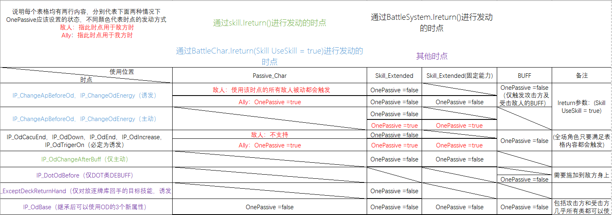

# 制作 `OD系统`相关的角色的MOD指南

## 简介

`OD系统`（OverDriveSystem），出自手游[ヘブンバーンズレット](https://heaven-burns-red.com/)，我在此mod中尽可能还原了原作中的系统，初衷是为游戏增加一些新的玩法和乐趣，为此，我也同时制作了便于角色开发的接口。如果你想要尝试制作一个 `OD系统相关角色`，这篇指引将会给你提供充分的帮助。

开发前，请复制`ODBarSystem\Assemblies`目录下的所有文件放到了你的项目文件夹下并进行引用，常用函数均使用XML进行了注释，可以在开发中进行查看。

---

[TOC]

## OD系统基本说明

本部分是OD系统的基本介绍说明，OD系统在战斗中显示如下：<center>
</center>

---

### 1.发动效果

当能量条积累满至少一条后（最大积累满3条），可以点击按钮发动OD，消耗当前所有能量并获得以下效果：

* OD发动期间，所有敌人将无法行动（使倒计时直接变为0的个别技能除外），敌人的行动倒数将不会减少。
* 根据发动OD时消耗的能量获得对战斗的增益效果
  ` 消耗100点（一条）`：手中所有牌费用降低**1**，打出**2**张手牌后解除OD状态。
  ` 消耗200点（两条）`：手中所有牌费用降低**2**，打出**3**张手牌后解除OD状态。
  ` 消耗300点（三条）`：手中所有牌费用降低**3**，打出**3**张手牌后解除OD状态。
* 最终伤害增加 **10%**（使用与水管相同的伤害时点）

*此外，回合结束按钮按下后，将直接解除OD状态。*

---

### 2.OD能量的累计方法

OD能量的获取主要包括三种方式：

1. 技能命中后获取能量
2. Dot类型伤害结算时获取能量
3. 通过函数直接获取能量
   
   **注意：在目前的版本中，前两项只有受击方是敌方时才能获取。**

#### 2.1技能命中敌方后获取

在这个MOD中，我引入了三个新的基本属性，应用在OD计算中，包括：

`连击能量（PlusOdEnergy）`（每点连击能量提供2.5点OD）、`OD获取量（PlusPerOd）`（按照百分比提供加成）以及：`直接获取OD的值(plusOd)`（技能不经过计算，直接获取的OD）。

当技能命中对方后，会进行OD能量的计算，具体计算流程如下,具体的时点将会在时点总结中进行使用说明。

---

##### 精简计算流程

当命中敌人的技能属于追加攻击时，跳过所有计算流程，默认提供2.5点OD能量。其他情况计算流程如下：

1. **IP_ChangeApBeforeOd**：可以设定命中敌人技能的、用于计算OD的AP消耗量 `NewApForOD`（仅对OD获取计算生效，并非真正改变消耗AP,默认为OD发动前的技能AP）
2. **初始化 OD 相关变量**：初始化 `plusPerOd`、`plusOd` 和 `PlusOdEnergy` ，默认为不做修改。
3. **IP_ChangeOdEnergy**：修改命中敌人技能的额外连击能量 `exOdEnergy` 。
4. **ODbase 计算**：基于上述数值进行OD 值的计算。
5. **IP_OdChangeAfterBuff**：该变ODbase 计算获得的OD值：`extraod`。
6. **修改 ODbase**：处理 `plusPerOd` 和 `plusOd` 修改 OD 值。
7. **IP_OdCacuEnd**：技能命中敌方的OD计算处理完毕，OD能量填充至OD槽后。

$$
ODEnergy = （5+ NewApForOD +(PlusOdEnergy+exOdEnergy)*2.5+extraod）*plusPerOd+plusOd
$$

计算流程大概可以如下表示：


#### 2.2通过Dot伤害获取

1. 每次敌人行动前，如果有 `Dot类Debuff`施加在敌人身上，则每种Debuff获取2.5点OD能量；

```csharp
IP_ChangeApBeforeOd //时点在每类Debuff伤害结算前生效，能够通过修改`ExtraOD`来该变改DOT能够获取的OD能量
```

2. 诸如日炎、雪刀的诱发类Dot伤害，每次被触发获取2点OD能量。

#### 2.3通过函数直接获取

使用唯一的该变OD的方法：

```csharp
StatementManger.ChangeOdCount(ODbase);
//ODbase接受一个浮点类型，大小介于[-300-300]的数。
```

---

## 接口

本部分将对该MOD的接口进行较为详细的说明，方便制作MOD时进行查询使用

#### 3.1 OnePassive

在超时空方舟中，涉及到接口的使用，就一定会涉及到

```csharp
OnePassive =true // OR False?
```

在这个Mod中，我基于原版逻辑设计了数个便于使用的接口，而为了正确的使用接口，接下来我会用最简单的方式向你解释本文中涉及时点的OnePassive（解释亦适用于同类型的原版接口），减少MOD制作中因OnePassive 使用产生的困惑。

首先我们需要定义两个名词，接下来本章节中的所有描述，都会基于此。

* **主动触发**：通过玩家主动操作，主动发动的效果（包括打出技能时触发的效果，点击按钮触发的效果等）
* **诱发**：无需玩家操作，仅是满足一定条件，即可发动的效果（包括所有的BUFF，手牌中满足条件自动触发的技能效果等）

在此基础上，我将本文涉及所有时点OnePassive的使用总结成如下表格，使用时可以进行查询。<center>


</center>

#### 3.2 时点使用说明

**注意：下文中OnePassive的设置部分已经在基类完成，故部分没有再次标出。接口OnePassive的使用请严格参照上文**

##### IP_ChangeApBeforeOd

```csharp
public interface IP_ChangeApBeforeOd
 {
     /// <summary>
     /// 可以设定命中敌人技能的、用于计算OD的AP消耗量（仅对OD获取计算生效，并非真正改变消耗AP）
     /// 【BattleChar的IReturn，支持返回使用技能】
     /// </summary>
     /// <param name="SkillD">命中敌人的技能</param>
     /// <param name="Target">受击敌人信息</param>
     /// <param name="NewApForOD">用于计算OD的AP消耗量，设置为-1为按照技能原本AP计算</param>
     /// <returns>敌方设置时使用，参照B_MonsterBuff_S1_ArmorBoss，用于保证怪物buff设置的的优先级最高</returns>
     bool SkillChangeApBeforeOd(Skill SkillD, BattleChar Target, ref int NewApForOD);
 }
```

使用示例：B_MonsterBuff_S1_ArmorBoss

```csharp
/// <summary>
 /// 铠甲防护
 /// 当呼吸的铠甲拥有【抵挡一次攻击】的护盾时，所有攻击将视为1AP来计算OD获取量,且技能的连击能量将下降2点
 /// </summary>
 public class B_MonsterBuff_S1_ArmorBoss : MonsterBuffBase, IP_ChangeApBeforeOd,IP_ChangeOdEnergy,IP_PlayerTurn_1
 {
     bool IP_ChangeApBeforeOd.SkillChangeApBeforeOd(Skill SkillD, BattleChar Target, ref int NewApForOD)
     {
         if (PerfectShieldmark)
         {
             NewApForOD = 1;
             return true;
         }
         return false;
     }

     void IP_ChangeOdEnergy.ChangeOdEnergy(Skill SkillD, BattleChar Target, ref int exOdEnergy)
     {
         if (PerfectShieldmark)
         {
             exOdEnergy = -2;
             PerfectShieldmark =false;
         }
     }
     public void Turn1()
     {
         PerfectShieldmark =true;
     }
     private bool PerfectShieldmark = false;
 }
```

---

##### IP_ChangeOdEnergy

```csharp
public interface IP_ChangeOdEnergy
    {
        /// <summary>
        /// 修改命中敌人技能的额外连击能量，晚于IP_AllChangeApHitsBeforeOd
        /// 【BattleChar的IReturn，支持返回使用技能】
        /// </summary>
        /// <param name="SkillD">命中敌方的技能</param>
        /// <param name="Target">技能目标（BattleEnemy）</param>
        /// <param name="exOdEnergy">额外连击能量</param>
        void ChangeOdEnergy(Skill SkillD, BattleChar Target, ref int exOdEnergy);
    }
```

使用示例：B_MonsterBuff_S1_ArmorBoss（见上）

---

##### IP_DotOdBefore

```csharp
public interface IP_DotOdBefore
 {
     /// <summary>
     /// 当前dot类型BUFF的每回合结算前时点。可以使用ExtraOD调整增加或减少该Dot的Od额外获得量
     /// </summary>
     /// <param name="Hit">dot对象的BattleEnemy</param>
     /// <param name="ExtraOD">返回值：Dot的Od额外增减量</param>
     void ExtraOdByDotBuff(BattleChar Hit, ref float ExtraOD);
 }
```

使用示例：B_MizuharaAina_DR1

```csharp
namespace MizuharaAina
{
    /// <summary>
    /// 蛋白分解毒素
    /// 防御力永久下降，行动时，受到相当于当前生命7%的HP的Dot伤害；\n分解的蛋白质将转换为OD能量，该BUFF带来的伤害将按比例提高该Dot的OD收益。
    /// </summary>
    public class B_MizuharaAina_DR1:BuffOD,IP_TurnEnd
    {
        public override void Init()
        {
            PlusStat.def = -10;
            base.Init();
        }
        public void TurnEnd()
        {
            dmg = AinaDataBase.CantDebuffEnemy.Contains(BChar.Info.KeyData) 
                ? 10 
                : Math.Max(1, BChar.HP*7 /100);

            PlusDamageTick = dmg;
        }

        public override void ExtraOdByDotBuff(BattleChar Hit, ref float ExtraOD) => ExtraOD = Math.Min(10, dmg / 10);

        private int dmg = 0;
    }
}
```

---

##### IP_ExceptDeckReturnHand（必须使用函数BV_ExceptDLC.GetSkillBackFromBV_ExceptDeck（）时才能触发）

```csharp
public interface IP_ExceptDeckReturnHand
{
/// <summary>
/// 时点，技能从放逐牌库返回手牌时(仅目标技能本身生效)
/// </summary>
    void At_ExceptDeckReturnHand();
}
```

使用示例：S_MizuharaAina_7

```csharp
/// <summary>
 /// 埋伏捕捞
 /// 进入<color=#17FF00>撒网捕捞</color>状态
 /// 当自己被攻击时，恢复体力极限并增加受到伤害的od。
 /// 此卡从放逐牌库返回手牌时，治疗全体成员&heal（60%治疗力）并使自己进入<color=#17FF00>撒网捕捞</color>状态。
 /// </summary>
 public class S_MizuharaAina_7:Skill_Extended,IP_ExceptDeckReturnHand
 {
     public override string DescExtended(string desc) => base.DescExtended(desc).Replace("&heal",$"{Mathf.Round(BChar.GetStat.reg)}");

     public void At_ExceptDeckReturnHand()
     {
         BattleSystem.instance.AllyTeam.AliveChars.ForEach(bc=>bc.Heal(BChar,BChar.GetStat.reg,60,0,0));
         BChar.BuffAdd("B_MizuharaAina_7", BChar);
     }
 }
```

---

##### IP_OdBase

```csharp
/// <summary>
    /// Od系统基础属性，适用于 技能、角色被动、buff、装备、遗物等（详细触发内容如下，晚于所有改变AP、连击能量的时点，早于修改额外Od的时点,参照流程图）
    /// 释放者被动诱发、受击方被动诱发，技能主动使用触发、固定技能主动使用触发、buff诱发（双方），遗物诱发，装备诱发
    /// 
    /// </summary>
    public interface IP_OdBase
    {
        /// <summary>
        /// OD百分比加成，乘算在技能基础OD上
        /// </summary>
        [Description("OD百分比加成，乘算在技能基础OD上")]
         float PlusPerOd { get; set; }

        /// <summary>
        /// 直接增加到Od槽中的数值,范围：(-300~300)，不受任何加成
        /// </summary>
        [Description("直接增加到Od槽中的数值,范围：(-300~300)，不受任何加成")]
        float PlusOd { get; set; }

        /// <summary>
        /// 连击能量，每点能量提供2.5点od
        /// </summary>
        [Description("连击能量，每点能量提供2.5点od")]
        int PlusOdEnergy { get; set; }
    }
```

使用示例：BuffOD 基类

```csharp
public class BuffOD : Buff, IP_DotOdBefore,IP_OdBase
    {
	//OD相关buff可以继承此类，直接使用IP_DotOdBefore和IP_OdBase的功能
        public virtual void ExtraOdByDotBuff(BattleChar Hit, ref float ExtraOD)
        { }

        public virtual float PlusPerOd { get; set; }
        public virtual float PlusOd { get; set; }
        public virtual int PlusOdEnergy { get; set; }
    }
```

---

##### IP_OdCacuEnd

```csharp
public interface IP_OdCacuEnd
{
    /// <summary>
    /// 技能命中的OD计算完毕，并填充到OD槽后
    /// BattleSytem的IReturn
    /// </summary>
    /// <param name="SP">命中敌人的技能</param>
    /// <param name="Tar">受击：仅敌人</param>
    /// <param name="Od">该技能计算后填充的OD值</param>
    void OdCacuEnd(SkillParticle SP, BattleChar Tar, float Od);
}
```

使用示例：B_MizuharaAina_1

```csharp
/// <summary>
/// 海盗连击
/// 下一个命中敌方的技能，连击能量提高&a点，生效一次后解除全体友军的该增益
/// </summary>
public class B_MizuharaAina_1:BuffOD,IP_OdCacuEnd
{
    public override string DescExtended()
    {
        if(BattleSystem.instance!=null)
            return base.DescExtended().Replace("&a", $"{PlusOdEnergy}");
        return base.DescExtended().Replace("&a", "0");
    }

    public IEnumerator RemoveAction()
    {
        foreach (var Bchar in BattleSystem.instance.AllyTeam.AliveChars)
        {
            Bchar.BuffRemove("B_MizuharaAina_1", ForceRemove: true);
        }
        yield break;
    }
    public void OdCacuEnd(SkillParticle SP, BattleChar Tar, float Od) => BattleSystem.DelayInput(RemoveAction());

    public override int PlusOdEnergy { get; set; }
}
```

---

##### IP_OdChangeAfterBuff

```csharp
[Description("技能OD计算后，可以修改ExtraOD控制od增减")]
public interface IP_OdChangeAfterBuff
{
    /// <summary>
    /// 技能OD计算后，可以修改ExtraOD控制od增减
    /// 【仅skill_extended使用生效】
    /// </summary>
    /// <param name="SkillD">命中敌人的技能</param>
    /// <param name="User">使用者</param>
    /// <param name="Target">受击敌人</param>
    /// <param name="ExtraOD">额外的OD增减</param>
    void OdSkillChangeBeforeFinal(Skill SkillD, BattleChar User, BattleChar Target, ref float ExtraOD);
}
```

使用示例：S_MizuharaAina_R2

```csharp
/// <summary>
/// PlusOdEnergy = 2;
/// 战斗开始且あいな在场上时，根据敌人数量获得<color=#35F9FF>海蓝之心</color>
/// 技能命中后，对敌方造成额外获得50点OD，并额外造成最大HP10%的痛苦伤害，之后优先抽取1个自己的技能；从放逐牌库返回手牌时，恢复友军1点AP，这张卡的费用将在这场战斗中永久上升3。
/// </summary>
public class S_MizuharaAina_R2:S_MizuharaAina_Base,IP_ExceptDeckReturnHand,IP_BattleStart_Ones
{
    public override void Init()
    {
        
        PlusOdEnergy = 2;
        base.Init();

    }

    public void BattleStart(BattleSystem Ins)
    {
        if (Ins != null && Ins.AllyTeam.AliveChars.FirstOrDefault(bc => bc.Info.KeyData == "MizuharaAina") != null)
            BattleSystem.instance.StartCoroutine(Delay());
    }

    public override void OdSkillChangeBeforeFinal(Skill SkillD, BattleChar User, BattleChar Target, ref float ExtraOD)
    {
        ExtraOD = 50;
        Target.Damage(BChar, Target.GetStat.maxhp / 10, false, true);
        BattleSystem.instance.AllyTeam.CharacterDraw(BChar);

    }
}
```

---

##### IP_OdDown

```csharp
[Description("Od下降时（发动OD不会触发此时点）")]
 public interface IP_OdDown
 {
     /// <summary>
     /// OD下降时（发动OD不会触发此时点）
     /// 【BattleSystem的IReturn触发】
     /// </summary>
     /// <param name="dltOd">下降的OD量（正数）</param>
     void AtOdDown(float dltOd);
 }
```

---

##### IP_OdEnd

```csharp
public interface IP_OdEnd
{
    /// <summary>
    /// Od结束时
    /// 【回合结束按钮按下、OD效果次数耗尽两种情况的OD结束能触发】【BattleSystem的IReturn触发】
    /// </summary>
    /// <param name="odLevel">本次OD发动的等级</param>
    /// <param name="odCountDuringOd">本次OD发动期间累计获得的OD能量</param>
    void AtOdEnd(int odLevel, float odCountDuringOd);
}
```

使用示例：S_MizuharaAina_2

```csharp
/// <summary>
/// 皺鰓鯊硬刃
/// 对敌方施加<color=#E560FF>Od脆弱</color>3回合，od中此技能消耗变成0费、迅速。
/// <color=#35F9FF>海蓝之心</color>:2
/// 施加一回合<color=#17FF00>【和あいな做好朋友吧】</color>
/// <color=#35F9FF>海蓝之心</color>:4
/// 施加后,若牌库中存在<color=#EDFAEC>【品尝深奥滋味】</color>，将其中一张加入手牌，将费用变成0费，并洗切牌堆
/// </summary>

public class S_MizuharaAina_2:S_MizuharaAina_Base
{
    public override void Init()
    {
        oceanHeartCost1 = 2;
        oceanHeartCost2 = 4;
        base.Init();
    }

    public override IEnumerator DrawAction()
    {
        if (StatementManger.OdSystemOn())
        {
            APChange = -MySkill.AP;
            MySkill.NotCount = true;
        }
        yield break;
    }

    public override void AtOdStart(int OdLevel)
    {
        base.AtOdStart(OdLevel);
        APChange = -MySkill.AP;
        MySkill.NotCount = true;
    }

    public override void AtOdEnd(int odLevel, float odCountDuringOd)
    {
        base.AtOdEnd(odLevel, odCountDuringOd);
        APChange = 0;
        MySkill.NotCount = false;
    }
```

---

##### IP_OdTrigerOn

```csharp
public interface IP_OdTrigerOn
 {
     /// <summary>
     /// OD发动时，BattleSystem的Ireturn范围都能够使用。
     /// </summary>
     /// <param name="OdLevel">当前OD等级</param>
     /// OD中降低费用的效果发生在AtOdStart前，因此即使在该时点再次降低技能费用，也可以在结束后正确回到原始费用
     void AtOdStart(int OdLevel);
 }
```

使用示例：S_MizuharaAina_2 （上文）

---

##### IP_OdIncrease

```csharp
public interface IP_OdIncrease
 {
     /// <summary>
     /// OD增加时【BattleSystem的IReturn触发】
     /// </summary>
     /// <param name="dlt"></param>
     void OdIncrease(float dlt);
 }
```

使用示例：B_MizuharaAina_P

```csharp
/// <summary>
/// 距离下一次获取海蓝之心，还需获得：&a点OD
/// 其他的OD获取量加成：&c%
///  </summary>
public class B_MizuharaAina_P:B_MizuharaAina_Base,IP_TurnEnd,IP_OdIncrease
{
    /// <summary>
    ///诱发，OD增加，尝试更新海蓝之心
    /// </summary>
    /// <param name="dlt"></param>
    void IP_OdIncrease.OdIncrease(float dlt) => PassiveControler.Instance.Odfilter += dlt;
```

---

#### 3.3 OD相关功能性函数

这部分是你可能会使用到的操控OD有关的功能函数，所有OD相关功能函数均在静态类 StatementManger 下，使用StatementManger .函数名直接使用。

| 函数名称 | 功能 |
| :----: | :----: |
|public static bool OdSystemOn() | 判断是否正在发动OD |
| public static IEnumerator OdForceOn(int odlevel) | （协程）OD能量大于100时强制发动OD|
|public static int GetOdLevel()|返回当前发动的OD等级|
|**public static void ChangeOdCount(float value)**|填充/降低OD能量的唯一方法|
|public static float GetOdCount()|获取当前OD值|
|public static float GetOdCountDuringOD()|仅OD发动期间使用，获取Od发动后当前累计获得的OD值|

---

#### 3.4 放逐牌库DLC

基于[贰玖君](https://steamcommunity.com/profiles/76561198339815561/myworkshopfiles/)创意工坊中的BasicMethod，我对放逐牌库进行了一个功能的扩展,扩展功能写在：`BV_ExceptDLC`类下

| 函数名称 | 功能 |
| :----: | :----: |
|public static IEnumerator GetSkillBackFromBV_ExceptDeck(参数说明见后文)| 批量从放逐牌库抽取技能 |

伴随接口：`IP_ExceptDeckReturnHand`一并使用能够触发特别制作的技能特效动画。
具体参数说明如下：

```csharp
</summary>
        /// <param name="num">抽取技能数量</param>
        /// <param name="onlyDrawMasterID">仅抽取该ID的角色的技能 skill.Master.Info.KeyData == onlyDrawMasterID.</param>
        /// <param name="exceptSkillHashSet">排除的技能哈希表，传入 MySkill.KeyID</param>
        /// <param name="drawWithBattleExtended">可选择附加到抽取技能上的Battle_extended</param>
        /// <returns></returns>
        public static IEnumerator GetSkillBackFromBV_ExceptDeck(int num, string onlyDrawMasterID = "",HashSet<string>exceptSkillHashSet = null, Skill_Extended drawWithBattleExtended  =null)
```

值得注意的是参数`exceptSkillHashSet`,由于放逐牌库返回手牌是原版游戏中没有的操作，因此需要对不应该返回手牌的技能进行批量筛选，此处需要传入一个包含`MySkill.KeyID`的`HashSet<string>`，可实现对放逐牌库进行筛选，不返回期待以外的技能。
我已经内置好了一个基础的集合，排除了与游戏机制相关的、技能大量生成的（例如幻影剑）的技能，只需要将`DevDatabase.cantBeGetBackExcepted`作为参数即可实现筛选。

此外，`drawWithBattleExtended`也是一个便利的参数，只需要创建好一个临时的 Skill_Extended并传入，就可以在抽取技能时为技能添加想要的扩展。
方法使用可以参考S_MizuharaAina_3、S_MizuharaAina_8等，简化代码展示如下：

```csharp
//无需json
public class Ext_Aina_8:Skill_Extended
{
    public override void Init()
    {
        MySkill.AP = 1;
        base.Init();
    }

    public override void SkillUseSingle(Skill SkillD, List<BattleChar> Targets)
    {
        BattleExtended = false;
        SelfDestroy();
    }
}
//其他代码
Ext_Aina_8 ext = new Ext_Aina_8(); //创建一个临时扩展，无需json
                yield return BV_ExceptDLC.GetSkillBackFromBV_ExceptDeck(num:1,
                    exceptSkillHashSet: AinaDataBase.cantBeGetBackExcepted, drawWithBattleExtended: ext);
//AinaDataBase.cantBeGetBackExcepted 为我自定义的排除技能集合
```

#### 3.5 基类

为方便使用，我已经将部分时点制作进了基类，减少你手动书写接口的工作，如果需要使用，可以参考如下：

##### Skill_ExtendedOd

```csharp
public class Skill_ExtendedOd : Skill_Extended, IP_OdChangeAfterBuff,IP_ChangeApBeforeOd,IP_OdBase
   {
       /// <summary>
       /// 可以设定命中敌人技能的、用于计算OD的AP消耗量（仅对OD获取计算生效，并非真正改变消耗AP）
       /// 【】
       /// </summary>
       /// <param name="SkillD">命中敌人的技能</param>
       /// <param name="Target">受击敌人信息</param>
       /// <param name="NewApForOD">用于计算OD的AP消耗量，设置为-1为按照技能原本AP计算</param>
       /// <returns>敌方设置时使用，参照B_MonsterBuff_S1_ArmorBoss，用于保证怪物buff设置的的优先级最高</returns>
       [Description("一个技能应该只实现一次该方法")]
       public virtual bool SkillChangeApBeforeOd(Skill SkillD, BattleChar Target, ref int NewApForOD)
       {
           return false;
       }

       /// <summary>
       /// 技能OD计算后，可以修改ExtraOD控制od增减
       /// 【仅skill_extended使用生效】
       /// </summary>
       /// <param name="SkillD">命中敌人的技能</param>
       /// <param name="User">使用者</param>
       /// <param name="Target">受击敌人</param>
       /// <param name="ExtraOD">额外的OD增减</param>
       public virtual void OdSkillChangeBeforeFinal(Skill SkillD, BattleChar User, BattleChar Target, ref float ExtraOD)
       {
       }

       public virtual float PlusPerOd { get; set; }
       public virtual float PlusOd { get; set; }
       public virtual int PlusOdEnergy { get; set; }
   }
```

---

##### BuffOD 

```csharp
public class BuffOD : Buff, IP_DotOdBefore,IP_OdBase
 {
     /// <summary>
     /// 当前dot类型BUFF的每回合结算前时点。可以使用ExtraOD调整增加或减少该Dot的Od额外获得量
     /// [仅Dot类型buff能够使用]
     /// </summary>
     /// <param name="Hit">dot对象的BattleEnemy</param>
     /// <param name="ExtraOD">返回值：Dot的Od额外增减量</param>
     public virtual void ExtraOdByDotBuff(BattleChar Hit, ref float ExtraOD)
     { }

     public virtual float PlusPerOd { get; set; }
     public virtual float PlusOd { get; set; }
     public virtual int PlusOdEnergy { get; set; }
 }
```

---

## 结语

本次MOD的制作耗时2个月左右全部完成，首先最感谢的是[贰玖君](https://steamcommunity.com/profiles/76561198339815561/myworkshopfiles/)，在MOD制作的过程中一直给与我帮助，以及强大的basicmethod，给超时空方舟mod制作打开了新的一条路。然后也要感谢星空演绎☆凛、[feiyap](https://steamcommunity.com/profiles/76561198034569911/)等大佬给我的帮助，从0开始制作一个全新机制的mod真的很不容易，缺少了你们任何人，都没有这个mod的诞生。
同样，还有一直给我的mod进行测试的@小补给、@...、@寒神无月等群友，你们的意见让这个mod变得更好。
最后，如果你在角色制作中有任何问题，都可以在steam与我进行联系，我将尽可能为你提供帮助。

---

